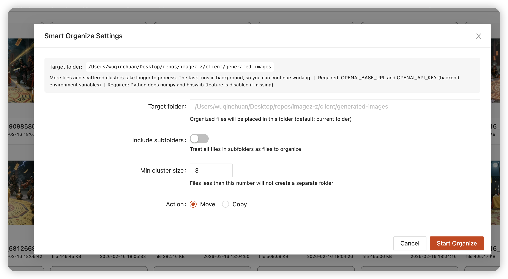
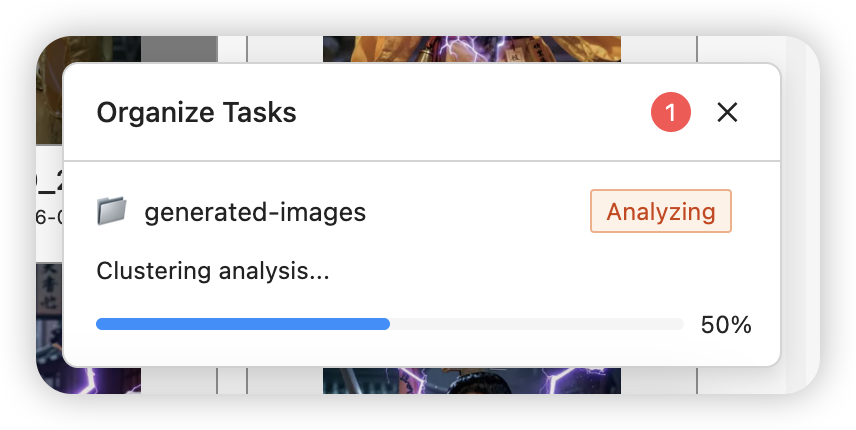
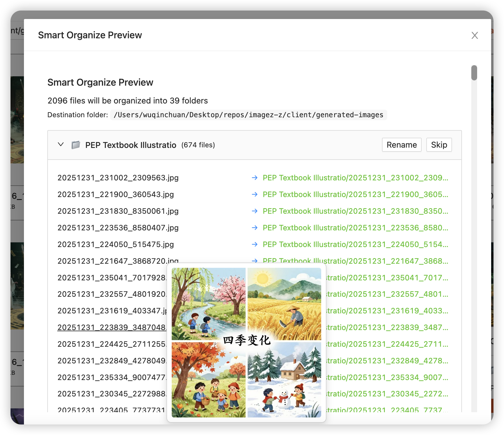
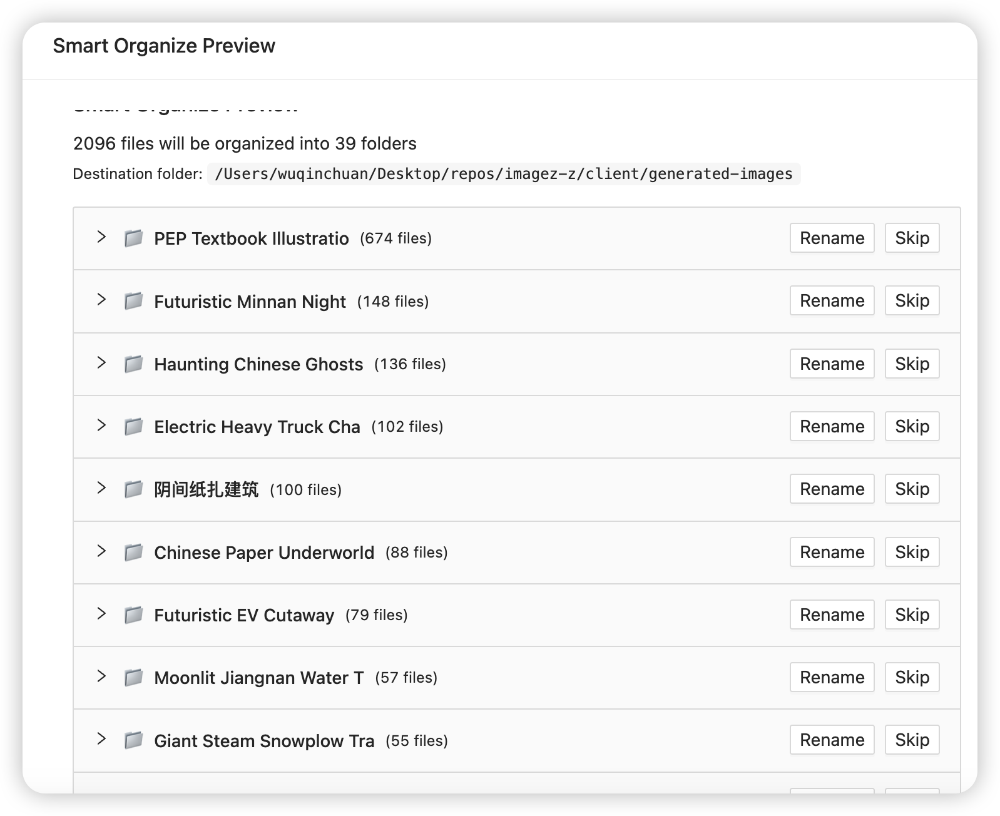

[跳到中文](#中文)
# English

## 2026-02-23
### 🎬 Inline Video Playback
Added inline video playback feature for video items wider than 400px.

**Features:**
- **Play Here Button**: Hover over a video to see the "Play Here" button in the bottom-left corner
- **Inline Playback**: Click to play the video directly in the grid item without opening a modal
- **Auto-Stop Others**: Automatically stops any other playing videos when starting a new one
- **Multi-language Support**: Button text is fully internationalized (English, Chinese, German)
- **Smart Reset**: Automatically stops playback when the list is reordered or refreshed

**How to use:**
1. Make sure your grid cell width is greater than 400px (adjustable in settings)
2. Hover over any video thumbnail
3. Click the "Play Here" button in the bottom-left corner
4. The video plays inline with full controls
5. Click elsewhere or play another video to stop

**Note:** The center play icon still opens the modal player for full-screen viewing.


## 2026-02-22
### 📝 Parse extra JSON metadata
Parse and mixin `extraJsonMetaInfo` field from image metadata.

### 🎡 Tips carousel
Added tips carousel component with 10 multilingual tips to help users discover features.

### 🗄️ Optimize database backup
Optimized database backup to run once per day and reduced max backups to 4.

### 📚 Docs improvements
Fixed URL encoding example with correct keywords and reorganized skill documentation.


## 2026-02-17
### 🗂️ Smart Organize - AI-Powered File Organization \

Automatically organize scattered images into meaningful folders using AI.

**Features:**
- **Semantic Clustering**: Groups images based on prompt similarity using AI embeddings
- **Auto-Generated Names**: AI creates meaningful folder names in your preferred language
- **Preview & Confirm**: Review the proposed organization before executing - skip or adjust any cluster
- **Background Processing**: Large folders process asynchronously without blocking your workflow
- **Flexible Options**: Move or copy, set minimum cluster size, include subfolders recursively

**How to use:**
1. Navigate to the folder you want to organize
2. Click **"Smart Organize"** button in the address bar
3. Configure options in the modal
4. Wait for AI analysis (embedding → clustering → title generation)
5. Preview the result - hover over filenames to see image thumbnails
6. Confirm to execute









https://github.com/user-attachments/assets/c1279556-d255-4e71-b230-48523a4859bf

> Requirements: Same as Topic Search - `OPENAI_BASE_URL`, `OPENAI_API_KEY`, Python deps `numpy`, `hnswlib`

### Flatten Folder
New feature to move all files from subfolders to the current folder with conflict detection.


## 2026-02-01
### Drag-and-drop into folders and safer move/copy
- Support drag-and-drop into folders with right-panel open fixes and UI adjustments.
- Add "continue on error" option for move/copy and a preset shortcut guide.

## 2026-01-30
### Added log file output
App now writes logs to `log.log` for easier diagnostics; UI styling refinements.

## 2026-01-29
### Added EXIF metadata browser
Browse EXIF/metadata with nested JSON navigation and syntax highlighting.

## 2026-01-26
### Sync delete events in TikTok viewer
Deleting items now stays in sync in TikTok-style view.

## 2026-01-25
### Refined TikTok info panel
Backdrop/preview return behavior adjusted; panel layout polished.

## 2026-01-24
### Fixed video stream Range handling
Improved large-file streaming throughput.

## 2026-01-22
### Tag validation, cleanup, and performance
Validate tag names, optimize tag queries, and add null-safety for tag creation.

## 2026-01-18
### ComfyUI prompt extraction and tag relation graph improvements
Add option to extract all ComfyUI prompts; improve tag relation graph filtering, fullscreen, and i18n.

## 2026-01-10
### Added tag relationship graph visualization
Topic cluster graph now visualized with ECharts.

## 2026-01-06
### Optional dependency handling
Support `IIB_SKIP_OPTIONAL_DEPS` and better optional package errors.

## 2026-01-05
### Install script refactor
Simplified package install flow and improved error handling.

## 2026-01-04
### Downloads and dependency versioning fixes
Fix multi-downloads, remove hardcoded test path, and lock major versions for key deps with runtime version info.

## 2026-01-03
### Topic search and clustering improvements
Show cached topics by default, improve clustering defaults, and make LLM title generation more robust.

## 2026-01-01
### Auth modal fixes
Avoid duplicate prompts and use proper password input.

## 2025-12-31
### Faster topic clustering
Accelerate clustering with ANN (hnswlib).

## 2025-12-29
### Async clustering and cached results
Run clustering jobs asynchronously with progress UI, cache embedding failures, and persist cluster results.

## 2025-12-28
### Non-blocking embeddings for topics
Make topic embedding non-blocking and cap input length.

## 2025-12-18
### Fixed video cover generation failures

## 2025-12-15
### Added audio file playback support and improved TikTok view
Now you can play audio files directly in IIB, with playback controls integrated into the TikTok-style viewer.

## 2025-11-30
### Implemented auto-tagging feature with custom tag rules
Automatically apply tags to images based on customizable rules.

## 2025-11-10
### Added WebM video format support

## 2025-8-24
### Improved TikTok viewer UX
- Added toggle for navigation buttons in global settings
- Improved video display in TikTok view using fit-content
- Maintaining video's original aspect ratio for better vertical scrolling experience

## 2025-8-23
### Added video tag search and random sort with i18n support

## 2025-7-13
### Added media type filter support for search functionality
Filter search results by image or video type.

## 2025-5-25  
### Added TikTok-Like view for viewing videos and images


## 2025-3-12
### Added Stealth Infotext parser support
Parse hidden metadata embedded in images using stealth PNG info technique.

## 2025-2-23
### Added "Try My Luck" feature
A fun feature to randomly browse your image collection.

## 2025-1-28
### Added pause polling when in image preview mode

## 2025-1-26
### Added support for Invoke.AI
Now you can view and parse metadata from images generated by Invoke.AI.

## 2024-12-26
### Added support for disabling maximize and fuzzy search with path-only option

## 2024-11-24
### Added batch download with no compression option
Download multiple files without packaging them into a zip archive.

## 2024-11-16
### Added support for more shortcut keys

## 2024-11-7

### Add support for categorizing and displaying custom tags alphabetically by first letter


## 2024-9-28
### Add support for custom tag colors

https://github.com/user-attachments/assets/bf80fcea-fbcf-4fb8-bba4-16063763d6a9


## 2024-9-7
###  Add quick entry for custom tags in more places


## 2024-8-24
### iib_app_cli: a precompiled command-line version


## 2024-8-18
### Add support for setting the current frame as the video cover


### Add support for disabling sync to implement simple settings isolation mechanism, storing related data only in the browser


## 2024-8-7
### Add option to control comma display in generated information


## 2024-7-27
### Add option to control auto-refresh


## 2024-7-18
### Added polling refresh feature


## 2024-7-17
### Implemented automatic refresh in walk mode

It's important to note that if you scroll down too much, IIB will not automatically update. This is a consideration for performance reasons.

https://github.com/user-attachments/assets/8526b66a-35c6-426f-8ca1-99cdd30b1bec


## 2024-7-15
### Added WorkspaceSnapshot feature. Added support for customizing the startup page


## 2024-7-10
### Added a PyInstaller-compiled version, significantly reducing the likelihood of false positives from antivirus software. 

[report](https://www.virustotal.com/gui/file/a23dda33e0e6b146938dac87310276e7a92849bcaee3af4198eba1398b8d1619?nocache=1)

## 2024-7-8

### Add support for pre-generating cache via startup parameters and specifying cache directory through environment variables


## 2024-7-3
### Implemented a simple plugin system that supports custom plugins
I wrote a Pixiv plugin that allows you to view the image information of Pixiv images directly in IIB. If you are interested in this or need to write your own plugin, you can take a look at this https://github.com/zanllp/pixiv_iib_plugin
## 2024-7-1
### Added 'Move To', 'Copy To', 'Copy File Path', and 'Open File Location in New Tab' to context menu


## 2024-6-29
### Removed the restriction on deleting the first file in fullscreen preview, fixed potential issues with exiting via ESC, and added support for exiting by double-clicking an image.


## 2024-6-27
### Support for adjusting mask background opacity


## 2024-6-26
### Added experimental side-by-side layout for fullscreen image browsing


https://github.com/zanllp/sd-webui-infinite-image-browsing/assets/25872019/993bf6a9-f23e-4ade-91da-8ee44f99c496


## 2024-6-24
### Implemented automatic synchronization of global settings to the backend
Related issue: https://github.com/zanllp/sd-webui-infinite-image-browsing/issues/509
## 2024-6-22
### Added support for pinnable search history records


## 2024-6-15
### Added full screen view button to floating  panel


### added support for .avif


## 2024-6-13
### Add support for StableSwarmUI


## 2024-6-11
### Significant performance optimizations
Scrolling is now much smoother in Walk mode
### Improved compatibility

#### Added Fixed mode to address existing compatibility issues, offering faster initialization speeds.


#### Users can now directly open SMB and other protocol folders in both Walk and Fixed modes.


### Added version information alerts
Users will be notified when a new release is available


## 2024-6-1
### Add support for NovelAI


## 2024-5-30
### Support fast addition of tags to the specified search box


https://github.com/zanllp/sd-webui-infinite-image-browsing/assets/25872019/14e2b194-329e-494d-9c26-7deba3bcd3e3


## 2024-5-26
### Add folder cover preview functionality

## 2024-5-21
###  Added support for rename


## 2024-4-14
### Added a Script for Folder Migration

Details at: [Proper Folder Migration to Avoid Data Loss](https://github.com/zanllp/sd-webui-infinite-image-browsing/wiki/Proper-Folder-Migration-to-Avoid-Data-Loss---%E6%AD%A3%E7%A1%AE%E7%9A%84%E8%BF%81%E7%A7%BB%E6%96%87%E4%BB%B6%E5%A4%B9%E9%81%BF%E5%85%8D%E6%95%B0%E6%8D%AE%E4%B8%A2%E5%A4%B1)

## 2024-4-13
### Add support for adding aliases to paths


## 2024-3-28
### Support Keep Multi-selected

https://github.com/zanllp/sd-webui-infinite-image-browsing/assets/25872019/823c9c8b-decb-4830-95d4-4b1f01ea298e


## 2024-3-27
### Added support for Fooocus


## 2024-3-22
### Add support for video streaming, video thumbnail generation, video search functionality, and video tagging


## 2024-3-21
### Added support for opening files with the system default application and saving selected file information as JSON


## 2024-3-15
### Add Support for WebUI's --subpath Option 


###  Add more isolation mechanisms and export functions for easier use as a library
https://github.com/zanllp/sd-webui-infinite-image-browsing/blob/main/vue/usage.md
## 2024-3-3
### Change indicators in grid view to determine which parameters were changed between images
Thanks to @fg-uulm for the contribution


## 2024-1-24
### Support manual control of dark mode


### Support floating information panel for viewing structured prompts
Thanks to @fg-uulm for the contribution


### Support simultaneous comparison of prompts during image comparison

Thanks to @fg-uulm for the contribution


## 2023-12-11
### Add support for opening page in new tab or side on the start page
Context Menu


## 2023-11-15
### Added support for searching within a specified folder.Removed the requirement for exact matching during searches. 


https://github.com/zanllp/sd-webui-infinite-image-browsing/assets/25872019/35347107-dd0c-403a-b6ed-576a3a1edcc2


## 2023-10-29
### Support batch adding/removing tags to images

https://github.com/zanllp/sd-webui-infinite-image-browsing/assets/25872019/8a3382bf-7b98-4f15-96f0-fbad9cd5ee97


## 2023-10-1
### Support removing unused tags by rebuilding image index


## 2023-9-23
### Add support for using regular expressions in fuzzy search


## 2023-9-12
### Added support for video playback

https://github.com/zanllp/sd-webui-infinite-image-browsing/assets/25872019/213bc40b-94f4-4290-8e5d-914c5e5d15e8


## 2023-9-10
### Added support for custom walk mode folder path


## 2023-9-8
### Add Traditional Chinese i18n support


## 2023-9-1
### Change image search to use pagination based on cursor instead of fixed maximum of 500 images. 
The modifications for this update include "Image Search" and "Fuzzy Search."
## 2023-8-31
### Add a new way to add tags

Clicking on the 'heart' icon or the tag list should both allow users to add tags to the image. 


## 2023-8-27
### If IIB is not running in a separate browser tab, then it will only send the file to the page it resides on. 
Related issue [#385](https://github.com/zanllp/sd-webui-infinite-image-browsing/issues/385).
## 2023-8-9
### Allows you to delete a single image without confirmation


## 2023-7-30
### More intuitive tag management
Color assignment based on text hash


### Added more convenient operations
#### Open the current folder with walk mode


#### Copy only positive prompts


#### Ability to directly delete an item from the quick move list on the home page, supports clearing "recent"


### Basic support for ComfyUI has been implemented
Details can be found at https://github.com/zanllp/sd-webui-infinite-image-browsing/issues/202
## 2023-7-28
### Refactored the walk mode
The original walk function only supported a file structure with two levels of folders. I refactored this functionality so that it no longer has any requirements on the folder structure. Additionally, you no longer need to worry about the size of the folders significantly impacting the speed, as everything is loaded on demand.

In addition to the homepage, you can also enable the walk function in the folder's right-click menu.


## 2023-7-23
### Add support for specialized access control paths and permissions
```.env
IIB_ACCESS_CONTROL=enable
IIB_ACCESS_CONTROL_ALLOWED_PATHS=save,extra
IIB_ACCESS_CONTROL_PERMISSION=read-only
```
For more details, please refer to https://github.com/zanllp/sd-webui-infinite-image-browsing/blob/main/.env.example.
## 2023-7-22
### Add batch download feature, support collecting selected images from other pages for download and archiving

https://github.com/zanllp/sd-webui-infinite-image-browsing/assets/25872019/94adc089-1e86-4915-931e-78c15e8bcdef


## 2023-7-21
### IIb layout has been readjusted to perfectly fill the space excluding the top tab
This fundamentally avoids the existence of double scroll bars, which used to rely on "open in new tab" to solve. I believe this can bring a significant improvement to the experience.


## 2023-7-19
### Improved custom tag display for better user experience. 
Allowing you to directly see which custom tags have been added. Currently set to activate only when the grid cell width is 
 more than 128px .


## 2023-7-17
### Added support for Lyco


### Added support for send to openOutpaint and for using send to ControlNet in a separate tab.


https://github.com/zanllp/sd-webui-infinite-image-browsing/assets/25872019/d89e7408-38a7-4eeb-84d1-cdcd01f090c9

## 2023-7-16
### Added new feature: copying files and creating folders.


## 2023-7-14

### Added support for custom grid image size

https://github.com/zanllp/sd-webui-infinite-image-browsing/assets/25872019/ac1519a2-1271-4f47-8912-a4d023bf669b


## 2023-7-10
Added support for using Ctrl+A to select all
## 2023-7-8
### The desktop app version has been released
see  https://github.com/zanllp/sd-webui-infinite-image-browsing/releases/tag/v0.0.1 for more infomation.


## 2023-6-28
### Added the `--sd_webui_path_relative_to_config` parameter 
```
--sd_webui_path_relative_to_config
                        Use the file path of the sd_webui_config file as the base for all relative paths provided within the sd_webui_config file.
```
Added the `--sd_webui_path_relative_to_config` parameter to solve the issue of unexpected behavior of relative paths in the input "config.json".
```bash
python app.py --sd_webui_config="C:\Users\zanllp\Desktop\stable-diffusion-webui\config.json" --port=7866 --sd_webui_path_relative_to_config
```
## 2023-6-27
### Added display of some basic information.


## 2023-6-26
### Added image comparison feature similar to imgsli

https://github.com/zanllp/sd-webui-infinite-image-browsing/assets/25872019/bedf1218-838c-49ce-9899-64e6ef34e01c


## 2023-6-24
### added support for opening folder via URL query params
```
http://127.0.0.1:7866/?action=open&path=extra
http://127.0.0.1:7866/?action=open&path=save
http://127.0.0.1:7866/?action=open&path=txt2img
http://127.0.0.1:7866/?action=open&path=img2img
http://127.0.0.1:7866/?action=open&path=C:\Users\zanllp\Desktop\sd-remote-save
```
https://github.com/zanllp/sd-webui-infinite-image-browsing/assets/25872019/c03a9c00-1f4f-40b1-8aff-f23fedd4181d


### Improve the user experience of using the path bar

https://github.com/zanllp/sd-webui-infinite-image-browsing/assets/25872019/aa3d8e4b-6eac-43f6-8891-121fdc5115f5


## 2023-6-18
### Support adding Extra paths to Quick Move through CLI.


```bash
python app.py --extra_paths /path/to/img/dir/1  /path/to/img/dir/2
```

## 2023-6-17
### Added default sorting method and viewing mode to global settings.


## 2023-6-10
### Added access control to ensure data security
By default, it is automatically enabled when the file system can be accessed externally. For a more detailed introduction, please [click here](https://github.com/zanllp/sd-webui-infinite-image-browsing/blob/main/.env.example)


## 2023-6-1
### Two new methods added to open the context menu
If you don't need to view generation information, I recommend collapsing the panel.


### Support for more shortcut key operations

### Enhanced display of current folder location


## 2023-5-30
### Support custom shortcut keys for deletion and favoriting
See demo at #159.

## 2023-5-27
### Added `Send to ControlNet `


## 2023-5-24
### Added support for authentication
You just need to create a `.env` file under the root directory of this extension and enter your key.

Then you will be prompted to enter your key when you open the extension.


If the authentication fails, all your requests will be rejected.
## 2023-5-22
## Add support for German language
Thanks to @KominoStyle for the contribution
## 2023-5-21
## Support for collapsing tag list

https://github.com/zanllp/sd-webui-infinite-image-browsing/assets/25872019/4dbf051e-4b4d-4148-964d-1dd99fe9c9aa
## Support adding current folder to quick move and search scan path

After adding, it will be possible to tag images in this folder and search for them using the search function.

Please add only necessary search scopes to avoid slow index updates.


## Support open with Local File Browser
In the right-click menu and the "More" menu in the upper right corner.

## 2023-5-18
### Introducing a new caching control mechanism

The good news is that it is no longer necessary to set the file name pattern separately, and this extension can now detect and ignore expired image cache in a timely manner.

The bad news is that all previous cache will need to be regenerated.


## 2023-5-16
### Add fuzzy search, supports searching by a part of the filename or generated information

The existing tag search is powerful and can perform precise filtering, but it is powerless for some natural language prompts. Fuzzy search is added as a supplement to address this issue.
## 2023-5-14
### 1. Support for using 'send to' in a tab opened with 'open in new tab'
Thanks to @wfjsw for the contribution
### 2. Advanced search support
Similar to Google, check it out at https://www.google.com/advanced_search


## 2023-5-12
### 1. Tree structure support for viewing with automatic refresh
When you return to the extension from elsewhere triggers. see https://github.com/zanllp/sd-webui-infinite-image-browsing/issues/120
### 2. Image search support for automatic detection of expired indexes
Triggered under the same circumstances as above, there will be a button to update the index when it expires.


# 中文

## 2026-02-23
### 🎬 视频原地播放功能
为宽度超过 400px 的视频 item 添加了原地播放功能。

**功能特性：**
- **"在此播放"按钮**：鼠标悬停在视频上时，左下角会显示播放按钮
- **原地播放**：点击按钮直接在网格 item 内播放视频，无需打开弹窗
- **自动停止其他视频**：播放新视频时，会自动停止其他正在播放的视频
- **多语言支持**：按钮文字支持多语言（英文、简体中文、繁体中文、德语）
- **智能重置**：列表重新排序或刷新时，自动停止播放

**使用方法：**
1. 确保网格单元格宽度大于 400px（可在设置中调整）
2. 将鼠标悬停在任意视频缩略图上
3. 点击左下角的"在此播放"按钮
4. 视频将在 item 内播放，带有完整的控制条
5. 点击其他位置或播放其他视频即可停止

**注意：** 中心的播放图标仍然可以打开模态框播放器进行全屏查看。


## 2026-02-22
### 📝 解析额外 JSON 元数据
解析并混入图片元数据中的 `extraJsonMetaInfo` 字段。

### 🎡 提示轮播
新增提示轮播组件，包含 10 条多语言提示，帮助用户发现功能。

### 🗄️ 优化数据库备份
优化数据库备份为每天一次，并减少最大备份数为 4 个。

### 📚 文档改进
修复 URL 编码示例中的关键词，并重组技能文档。


## 2026-02-17
### 🗂️ 智能整理 - AI 驱动的文件整理

使用 AI 自动将零散图片整理到有意义的文件夹中。

**功能特性：**
- **语义聚类**：基于 AI 向量化技术，自动将语义相似的图片分组
- **智能命名**：AI 自动生成有意义的文件夹名称，支持多语言
- **预览确认**：执行前可预览整理方案，支持跳过或调整特定分组
- **后台处理**：大文件夹在后台异步处理，不影响继续使用
- **灵活配置**：支持移动/复制、设置最小聚类大小、递归处理子文件夹

**使用方法：**
1. 进入需要整理的文件夹
2. 点击地址栏中的「智能整理」按钮
3. 在弹窗中配置选项
4. 等待 AI 分析（向量化 → 聚类 → 生成标题）
5. 预览整理方案 - 鼠标悬停文件名可查看缩略图
6. 确认执行


https://github.com/user-attachments/assets/c1279556-d255-4e71-b230-48523a4859bf

> 前置条件：与自然语言搜索相同 - `OPENAI_BASE_URL`、`OPENAI_API_KEY`、Python 依赖 `numpy`、`hnswlib`

### 压平文件夹
新功能：将所有子文件夹中的文件移动到当前文件夹，支持文件名冲突检测。


## 2026-02-01
### 支持拖拽到文件夹与更安全的移动/复制
- 支持拖拽文件到文件夹，并修复右侧打开文件夹与界面细节。
- 新增移动/复制“出错继续”选项与预设快捷键指引。

## 2026-01-30
### 新增日志文件输出
程序会写入 `log.log` 便于排查问题，同时优化了部分 UI 样式。

## 2026-01-29
### 新增 EXIF 元数据浏览器
支持 EXIF/元数据分层浏览与高亮显示。

## 2026-01-26
### TikTok 视图删除同步
删除操作在 TikTok 风格视图中保持同步。

## 2026-01-25
### TikTok 信息面板优化
调整背景遮罩与预览返回逻辑，优化面板布局。

## 2026-01-24
### 修复视频流 Range 解析
提升大文件视频流吞吐。

## 2026-01-22
### 标签校验、清理与性能优化
新增标签名校验与清理，优化标签查询，并补充空值安全处理。

## 2026-01-18
### ComfyUI 提示词导出与标签关系图优化
新增一次性提取全部 ComfyUI 提示词；改进标签关系图筛选、全屏与多语言。

## 2026-01-10
### 新增标签关系图可视化
为 Topic 聚类提供关系图可视化（ECharts）。

## 2026-01-06
### 可选依赖处理优化
支持 `IIB_SKIP_OPTIONAL_DEPS`，并改进可选依赖报错信息。

## 2026-01-05
### 安装脚本重构
简化依赖安装流程并增强错误处理。

## 2026-01-04
### 下载与依赖版本修复
修复多文件下载、移除硬编码测试路径，并锁定关键依赖主版本与运行时版本信息。

## 2026-01-03
### Topic 搜索与聚类改进
默认展示缓存主题、优化聚类默认参数，并增强 LLM 标题生成稳定性。

## 2026-01-01
### 认证弹窗修复
避免重复提示并使用密码输入框。

## 2025-12-31
### Topic 聚类加速
使用 ANN（hnswlib）提升聚类性能。

## 2025-12-29
### 异步聚类与结果缓存
聚类任务异步执行并展示进度，缓存 embedding 失败，并持久化聚类结果。

## 2025-12-28
### Topic embedding 非阻塞
Topic embedding 改为非阻塞并限制输入长度。

## 2025-12-18
### 修复视频封面生成失败

## 2025-12-15
### 新增音频文件播放支持，改进TikTok视图
现在可以直接在IIB中播放音频文件，播放控件已集成到TikTok风格的查看器中。

## 2025-11-30
### 实现自动打标签功能
支持基于自定义规则自动为图片添加标签。

## 2025-11-10
### 新增WebM视频格式支持

## 2025-8-24
### 改进TikTok查看器体验
- 全局设置中添加导航按钮开关
- 使用fit-content改进视频显示
- 保持视频原始纵横比，改善垂直滚动体验

## 2025-8-23
### 新增视频标签搜索和随机排序，支持多语言

## 2025-7-13
### 新增媒体类型筛选器
搜索结果支持按图片或视频类型筛选。

## 2025-5-25
### 新增TikTok视图用于查看视频和图片


## 2025-3-12
### 新增Stealth Infotext解析器
支持解析使用隐写PNG信息技术嵌入的隐藏元数据。

## 2025-2-23
### 新增"试试手气"功能
随机浏览图片集合的趣味功能。

## 2025-1-28
### 图片预览模式下暂停轮询刷新

## 2025-1-26
### 新增Invoke.AI支持
支持查看和解析Invoke.AI生成的图片元数据。

## 2024-12-26
### 支持禁用最大化和仅路径模糊搜索选项

## 2024-11-24
### 新增批量下载无压缩选项
下载多个文件时可选择不打包成zip压缩包。

## 2024-11-16
### 支持更多快捷键

## 2024-11-7

### 自定义tag支持以首字母分类排列展示


## 2024-9-28
### 支持自定义tag颜色

https://github.com/user-attachments/assets/bf80fcea-fbcf-4fb8-bba4-16063763d6a9


## 2024-9-7
### 添加更多自定义tag的入口


## 2024-8-24
### iib_app_cli: 预编译的命令行版本

## 2024-8-18
### 支持设置当前帧作为视频封面


### 支持关闭同步，以实现简单的设置隔离机制，仅在浏览器中存储相关数据


## 2024-8-7
### 添加选项控制生成信息面板的逗号


## 2024-7-27
### 添加选项来控制自动刷新


## 2024-7-18
### 新增轮询刷新功能


## 2024-7-17
### 实现了walk模式下的自动更新

需要注意的是如果你向下滚动太多的话IIB将不会自动更新，这是出于性能的考虑

https://github.com/user-attachments/assets/8526b66a-35c6-426f-8ca1-99cdd30b1bec


## 2024-7-15
### 添加了工作区快照的功能，支持自定义启动页面


## 2024-7-10
### 新增了pyinstaller编译的版本，大幅度降低了杀毒软件误报的概率。

[report](https://www.virustotal.com/gui/file/a23dda33e0e6b146938dac87310276e7a92849bcaee3af4198eba1398b8d1619?nocache=1)

## 2024-7-8

### 支持通过启动参数提前生成缓存 ，支持通过环境变量特化缓存文件夹


## 2024-7-3

### 实现了个简单的插件系统，支持自定义插件

我还写个Pixiv插件，可以直接在IIB里面看Pixiv图片的图形信息了。如果你对这个感兴趣，或者你需要写自己个插件，可以看看这个

[插件](https://github.com/zanllp/pixiv_iib_plugin）

## 2024-7-1
### 添加 移动到/ 复制到 / 复制文件路径 和在新标签页打开文件位置 到上下文菜单


## 2024-6-29
### 去除全屏预览下第一个文件不能删除的限制，修复ESC可能无法退出，新增支持双击图片退出


## 2024-6-27
### 支持调整遮罩透明度


## 2024-6-26
### 新增全屏浏览时的实验性并排布局


https://github.com/zanllp/sd-webui-infinite-image-browsing/assets/25872019/993bf6a9-f23e-4ade-91da-8ee44f99c496

## 2024-6-24
### 实现自动同步全局设置到后端
相关issue: https://github.com/zanllp/sd-webui-infinite-image-browsing/issues/509


## 2024-6-22
### 添加了带固定功能的搜索历史


## 2024-6-15
### 浮动面板增加全屏查看按钮


### 支持.avif


## 2024-6-13
### 支持StableSwarmUI


## 2024-6-11
### 显著的性能优化
在Walk模式下，滚动现在更加流畅
### 提高兼容性

#### 添加了Fixed模式以解决现有的兼容性问题，提供更快的初始化速度。


#### 用户现在可以在Walk模式和Fixed模式下直接打开SMB等协议文件夹。


### 新增版本信息提醒
用户将在有新版本可用时收到通知


## 2024-6-1
### 添加对NovelAI的支持


## 2024-5-30
### 支持快速添加tag到指定搜索框


https://github.com/zanllp/sd-webui-infinite-image-browsing/assets/25872019/14e2b194-329e-494d-9c26-7deba3bcd3e3


## 2024-5-26
### 文件夹封面预览

## 2024-5-21
### 支持重命名


## 2024-4-14
### 添加了一个脚本用于文件夹迁移

详情见：https://github.com/zanllp/sd-webui-infinite-image-browsing/wiki/Proper-Folder-Migration-to-Avoid-Data-Loss---%E6%AD%A3%E7%A1%AE%E7%9A%84%E8%BF%81%E7%A7%BB%E6%96%87%E4%BB%B6%E5%A4%B9%E9%81%BF%E5%85%8D%E6%95%B0%E6%8D%AE%E4%B8%A2%E5%A4%B1

## 2024-4-13
### 支持给路径添加别名


## 2024-3-28
### 支持保留多选

https://github.com/zanllp/sd-webui-infinite-image-browsing/assets/25872019/823c9c8b-decb-4830-95d4-4b1f01ea298e


### 支持Fooocus


### 支持视频流式，视频封面自动生成，视频搜索，以及给视频打标签 


## 2024-3-21
### 支持使用系统默认应用打开文件，支持保存选中的文件信息


## 2024-3-15
### 支持sd webui的 --subpath 选项


###  导出更多函数支持方便控制IIB
https://github.com/zanllp/sd-webui-infinite-image-browsing/blob/main/vue/usage.md
## 2024-3-3
### 添加网格视图中的更改指示器，以确定图像之间更改了哪些参数
Thanks to @fg-uulm for the contribution


## 2024-1-24
### 支持手动控制深色模式


### 支持浮动信息面板支持查看结构化Prompt
感谢 @fg-uulm 的贡献

### 支持图像比较时同时支持比较Prompt
感谢 @fg-uulm 的贡献


## 2023-12-11
### 在启动页打开页面支持打开到新tab或者侧边
右键菜单


## 2023-11-15
### 支持在指定文件夹内进行搜索，并且搜索时不再要求精确匹配


https://github.com/zanllp/sd-webui-infinite-image-browsing/assets/25872019/35347107-dd0c-403a-b6ed-576a3a1edcc2

## 2023-10-29
### 支持给图像批量添加tag和移除tag
https://github.com/zanllp/sd-webui-infinite-image-browsing/assets/25872019/8a3382bf-7b98-4f15-96f0-fbad9cd5ee97

## 2023-10-1
### 支持重建图像索引来移除无用的tag


## 2023-9-23
### 模糊搜索添加正则式支持


## 2023-9-12
### 支持视频播放

https://github.com/zanllp/sd-webui-infinite-image-browsing/assets/25872019/213bc40b-94f4-4290-8e5d-914c5e5d15e8


## 2023-9-10
### 支持自定义walk模式的路径


## 2023-9-8
### 支持繁体中文


## 2023-9-1
### 图像搜索获取的图片从固定最大500个改成基于cursor的分页加载形式
本次修改包括”图像搜索“和”模糊搜索“
## 2023-8-31
### 新增一个添加tag方式
点击”爱心“ 图标或者tag列表都能给图片添加tag


## 2023-8-27

### 如果IIB不是运行在一个单独的浏览器tab中的话，那么它将只会把文件发送到它所在的页面

相关issue [#385](https://github.com/zanllp/sd-webui-infinite-image-browsing/issues/385)

### 允许你删除单张图片而无需确认


## 2023-7-30
### 更直观的tag管理
基于文本hash分配颜色


### 新增更多便利的操作
#### 使用walk模式打开当前文件夹


#### 仅复制正向的提示词


#### 可以直接在首页删除快速移动列表的某一项，支持清理`最近`


### 实现了对ComfyUI的一些基础支持
详情看 https://github.com/zanllp/sd-webui-infinite-image-browsing/issues/202
## 2023-7-27
### 重构walk功能
原有的walk仅支持2级的文件夹速度，我重构了这个功能现在对文件夹结构不再有要求。并且你不需要担心文件夹的大小会影响太多速度，一切都是按需加载。
除了首页外你还在文件夹右键菜单里面开启walk功能。


## 2023-7-23
### 增加特化访问控制路径和权限的支持
```.env
IIB_ACCESS_CONTROL=enable
IIB_ACCESS_CONTROL_ALLOWED_PATHS=save,extra
IIB_ACCESS_CONTROL_PERMISSION=read-only
```
有关更多详细信息，请参见 [https://github.com/zanllp/sd-webui-infinite-image-browsing/blob/main/.env.example ↗](https://github.com/zanllp/sd-webui-infinite-image-browsing/blob/main/.env.example)。
## 2023-7-22
### 新增批量下载功能，支持从其他页面收集选中图片进行打包下载和归档

https://github.com/zanllp/sd-webui-infinite-image-browsing/assets/25872019/94adc089-1e86-4915-931e-78c15e8bcdef
## 2023-7-21
### 重新调整了IIb的布局，让它能够刚好占满除顶部tab以外的空间
从根本上避免了双重滚动条的存在，以前都是依赖于“在新tab打开”来解决这个事情，我认为这能够给体验带来个非常大的进步


## 2023-7-19
### 改进自定义tag的用户体验
允许你直接看到添加了哪些自定义的tag。目前设定在网格宽度在128px以上时才启用


## 2023-7-17
### 新增对lyco的支持

### 支持发送到openOutpaint 和在单独tab使用 发送到ControlNet


https://github.com/zanllp/sd-webui-infinite-image-browsing/assets/25872019/d89e7408-38a7-4eeb-84d1-cdcd01f090c9
## 2023-7-16
### 新功能：创建文件夹和复制文件


## 2023-7-14

### 支持自定义网格图像尺寸

https://github.com/zanllp/sd-webui-infinite-image-browsing/assets/25872019/ac1519a2-1271-4f47-8912-a4d023bf669b

## 2023-7-10
支持使用ctrl+a全选
## 2023-7-8
### 桌面app版本发布
详情见  https://github.com/zanllp/sd-webui-infinite-image-browsing/releases/tag/v0.0.1  

## 2023-6-28
### 添加了 `--sd_webui_path_relative_to_config` 参数 

```
--sd_webui_path_relative_to_config
                        Use the file path of the sd_webui_config file as the base for all relative paths provided within the sd_webui_config file.
```

添加了 `--sd_webui_path_relative_to_config` 参数用于 解决输入的"config.json"文件内部的相对路径表现不符合预期的行为
```bash
python app.py --sd_webui_config="C:\Users\zanllp\Desktop\stable-diffusion-webui\config.json" --port=7866 --sd_webui_path_relative_to_config
```
## 2023-6-27
### 添加了一些基础信息的显示


## 2023-6-26
### 添加了类似imgsli的图像比较功能

https://github.com/zanllp/sd-webui-infinite-image-browsing/assets/25872019/bedf1218-838c-49ce-9899-64e6ef34e01c

## 2023-6-24
### 支持通过url query params直接打开文件夹
```
http://127.0.0.1:7866/?action=open&path=extra
http://127.0.0.1:7866/?action=open&path=save
http://127.0.0.1:7866/?action=open&path=txt2img
http://127.0.0.1:7866/?action=open&path=img2img
http://127.0.0.1:7866/?action=open&path=C%3A%2FUsers%2Fzanllp%2FDesktop%2Fstable-diffusion-webui%2Flog%2Fimages
```
https://github.com/zanllp/sd-webui-infinite-image-browsing/assets/25872019/c03a9c00-1f4f-40b1-8aff-f23fedd4181d

## 2023-6-24
### 改善路径栏的使用体验
https://github.com/zanllp/sd-webui-infinite-image-browsing/assets/25872019/aa3d8e4b-6eac-43f6-8891-121fdc5115f5


### 支持通过cli添加额外路径到快速移动
```bash
python app.py --extra_paths /path/to/img/dir/1  /path/to/img/dir/2
```
## 2023-6-17
### 全局设置新增默认排序方法和默认显示模式 


## 2023-6-10
### 新增访问控制模式，以确保数据安全
默认在文件系统可能会被外部访问到时自动启用. [ 点这里查看更多](https://github.com/zanllp/sd-webui-infinite-image-browsing/blob/main/.env.example)


## 2023-6-1
### 新增两种打开上下文菜单的方法
如果不需要生成信息我推荐将面板收起


### 支持更多快捷键操作
### 增强当前文件夹位置显示


## 2023-5-30
### 支持使用自定义快捷键进行删除和收藏
演示见 #159
## 2023-5-27
### 新增`发送到ControlNet`


### 2023-5-24
### 添加了对身份验证的支持
你只需要在插件下面创建一个.env，输入你的key。

然后在你打开时就会要求你输入了

如果没有验证超过，会拒绝掉你的所有请求

## 2023-5-21
## tag列表支持展开收起


https://github.com/zanllp/sd-webui-infinite-image-browsing/assets/25872019/4dbf051e-4b4d-4148-964d-1dd99fe9c9aa


## 支持添加当前文件夹到快速移动和搜索扫描路径

添加后允许对这里的图像也进行打标签，使用搜索也能搜出这边的图像了。

尽可能只添加需要的搜索范围，避免索引更新较慢。


## 支持使用文件浏览器打开当前文件夹
在右键菜单和右上角的“更多”里面
## 2023-5-18
### 引入新的缓存控制机制
好消息是不再需要单独设置也能及时发现并忽略掉过期的缓存。 坏消息是是之前的缓存都需要重新生成 
## 2023-5-16
### 新增模糊搜索，支持使用文件名或者生成信息的部分来进行搜索
原有的tag搜索很强大，可以进行很精确的匹配筛选，但对一些自然语言的prompt无能为力，新增模糊搜索作为补充
## 2023-5-14
### 1.支持在使用’在新tab打开‘打开的tab使用'发送到'
感谢 @wfjsw  的贡献
### 2. 支持高级搜索
和谷歌的差不多 https://www.google.com/advanced_search


## 2023-5-12
### 1.使用树状图结构视图进行查看时支持自动刷新
当你从其他地方返回拓展时触发
### 2.图像搜索支持自动检测索引过期
触发时机同上，过期了会出现索引更新的按钮点一下就能更新了

